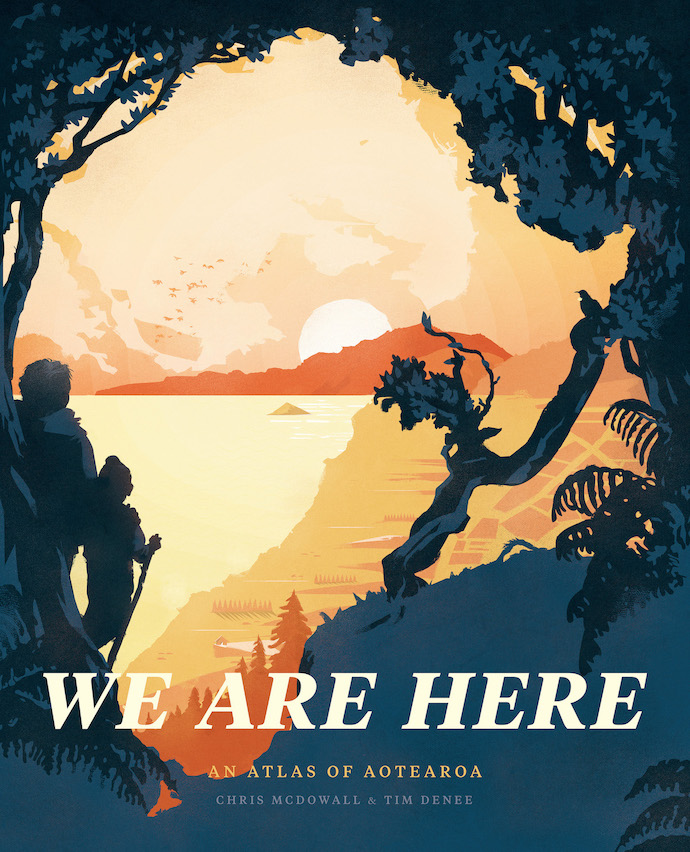

# We Are Here: An Atlas of Aotearoa

## Technical notes, data sources and code

This repository contains code and data for [We Are Here: An Atlas of Aotearoa](https://www.masseypress.ac.nz/books/we-are-here/). This is the place to look if you are curious where the data came from and how we created the various maps and charts. We have tried to include as much of the source code as possible.

Although we used [QGIS](https://qgis.org/en/site/) heavily, we have not included any QGIS project files as Chris didn't really set them up with distribution in mind (aka they're a bit of a mess).

The repository is organised into folders that correspond to the book's chapters. If you are interested in something that's not here, please get in touch with Chris McDowall through Github or via this [contact form](https://fogonwater.com/).

## Here be dragons...

Be warned that this code was written to get the job done rather than with an audience in mind. There are rough edges and confusing bits. Good luck, adventurer!

Keep scrolling for an overview of tools, software, data formats and map projections.

Public domain image: [From page 478 of 'Ripon Millenary [1886]. A record of the Festival. Also a history of the City arranged under its Wakemen and Mayors from the year 1400](https://www.flickr.com/photos/britishlibrary/11301297315/in/gallery-141992302@N07-72157676374914694/), British Library HMNTS 10368.r.4.

## Tools and software

We used a wide variety of tools and data formats to create this atlas. With the exception of the Adobe design products, all the software is free and open source.

### General purpose software

- [Python](https://www.python.org/): a general purpose programming language. We used it extensively to harvest, prepare and transform data. Python was the project’s glue and Swiss army knife.
- [Beautiful Soup](https://www.crummy.com/software/BeautifulSoup/bs4/doc/): a Python library for transforming semi-structured documents into data.
- [JavaScript](https://en.wikipedia.org/wiki/JavaScript): a high-level programming language that is a core technology of the modern web.
- [D3.js](https://d3js.org): a JavaScript library for processing and visualising data. Many of the custom charts were created with D3.js.

### Statistical software

- [R](https://www.r-project.org/): a free software environment for statistical computing and graphics. R was created in 1993 by Ross Ihaka and Robert Gentleman at the University of Auckland. Today R is one of the most popular programming languages in the world. We used R for statistical analyses, data transformation and chart creation.
- [tidyr](https://tidyr.tidyverse.org/): a package that extends R for tidying 'messy' data.
- [dplyr](https://dplyr.tidyverse.org/): a package that expands R’s data manipulation functionality.
- [ggplot2](https://ggplot2.tidyverse.org/): a package that expands R’s data visualisation capabilities. Both tidyr and ggplot2 were developed by New Zealander Hadley Wickham, and are part of the tidyverse suite of tools.

### Mapping tools

- [QGIS](https://qgis.org/en/site/): an open-source geographic information system (GIS). Most of the book’s maps were created with QGIS.
- [GDAL](https://gdal.org/): the Geospatial Abstraction Library makes it easier to read and write geographic data.
- [Mapnik](https://mapnik.org/): software for rendering maps using programming code and style rules. We used Mapnik to create some of the trickier maps in the book.
- [TileMill](https://tilemill-project.github.io/tilemill/): an open-source map design tool. We used TileMill to design styles for Mapnik.
- [Mapshaper](https://mapshaper.org/): a tool for topologically aware shape simplification.

### Design tools

The only proprietary software we used were three design and publication tools from [Adobe](https://www.adobe.com/): 

- Adobe Illustrator: an editor for working with vector graphics. We prepared each individual spread in Illustrator.
- Adobe Photoshop: an editor for working with raster graphics.
- Adobe InDesign: an editor for desktop publishing and typesetting. The individual spreads were gathered together in InDesign for publishing. 

## Data formats and terminology

- **CSV**: a plaintext spreadsheet where all the values are separated by a special character — usually a comma. CSV stands for comma separated values.
- **JSON**: JavaScript object notation is a file format that uses human-readable text to represent data objects.
- **XML**: extensible markup language is a flexible language for encoding and annotating documents.
- **PNG**: portable network graphics is a lossless image format.
- **JPEG**: a common method for lossy image compression developed by the Joint Photographic Experts Group.
- **SVG**: scalable vector graphics is a plaintext format for describing vector graphics.
- **PDF**: portable document format is a popular file format for presenting documents. We sometimes used PDFs as an interchange format between software packages.
- **Layer**: a specific dataset on a map, often unified around a theme. For example, there might be one layer for roads and another layer for lakes.
- **Shapefile**: a popular format for storing and sharing vector data in a geographic information system.
- **LiDAR**: a technique that uses lasers to sample and measure the earth’s surface. We used point clouds of terrain LiDAR (light detection and ranging) to create certain maps.
- **DEM**: digital elevation models are gridded representations of a terrain surface.
- **Shaded relief**: a cartographic layer that depicts terrain surfaces through light and shadow.
- **CartoCSS**: a formatting language for controlling the appearance of digital maps.
- **KML**: Keyhole markup language is an XML notation for describing and sharing geographic data.

## Map projections

Map projections are systems for translating the 3D surface of the Earth onto a 2D surface, like a page or a screen. Nearly every map in this book is depicted using [New Zealand Transverse Mercator 2000](https://www.linz.govt.nz/data/geodetic-system/datums-projections-and-heights/projections/new-zealand-transverse-mercator-2000) (NZTM2000). Land Information New Zealand recommends that NZTM2000 is used when creating maps within mainland New Zealand. Exceptions are noted in the technical notes for specific spreads. 
