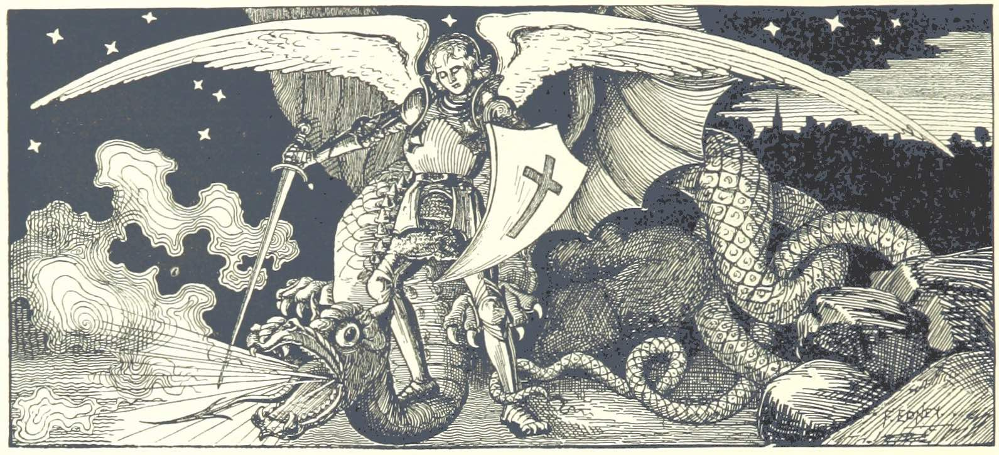

# We Are Here: An Atlas of Aotearoa
## Technical notes, data sources and code

Code and data for the We Are Here atlas.

## Here be dragons...

Public domain image: [Image taken from page 478 of 'Ripon Millenary [1886]. A record of the Festival. Also a history of the City arranged under its Wakemen and Mayors from the year 1400](https://www.flickr.com/photos/britishlibrary/11301297315/in/gallery-141992302@N07-72157676374914694/), British Library HMNTS 10368.r.4.